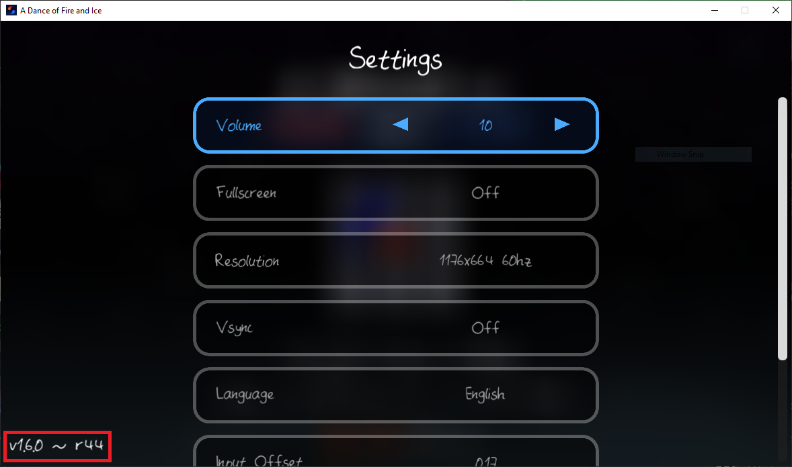
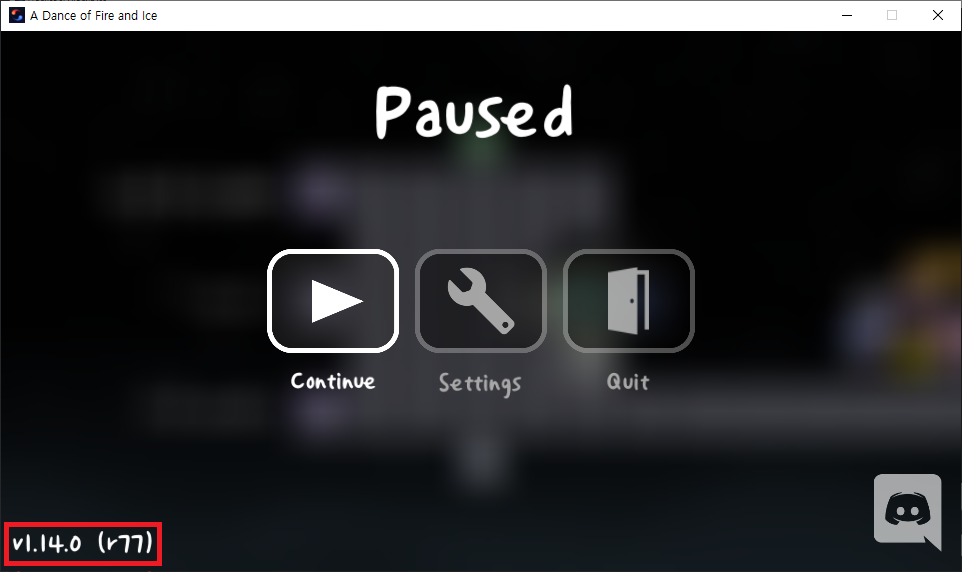

# English Modding Guide

<ins>[[< Previous Page]](./main.md)</ins> <ins>[[Next Page >]](./use-2.md)</ins>

## Installing and configuring UnityModManager

### Installing UnityModManager

1. `UnityModManager` installation link: https://github.com/newman55/unity-mod-manager
   - Click the **Dropbox** text to download the file.
2. Unzip the downloaded `UnityModManager.zip`.
   - **Do not** unzip the file inside ADOFAI's directory!
3. If needed, [edit](#File-Editing) the `UnityModManagerConfig.xml` file based on [your game's version](#How-to-check-your-games-version) and execute the `UnityModManager.exe` file.
4. Configure `UnityModManager`.
   - Click the `Install` tab.
   - Click the dropdown next to the `Game` text, and select `A Dance of Fire and Ice`.
   - Click the button next to the `Folder` text, and select the folder (preferably the Steam folder) that contains the .exe file of ADOFAI. After selecting the folder, you can click OK.
   - Choose `Assembly` in the `Installation Method` group.
   - After clicking the `Install` button, please check if notepad pops up after executing the game. If notepad pops up, it means something went wrong while editing `UnityModManagerConfig.xml`. If you can't see what's wrong and need help, you can always join the [ADOFAI Modding Community Discord](https://discord.gg/AGFXhCfyE5) and ask for help.
   - If you are having a hard time understanding, you can follow the same steps using image below. The correct sequence is Red → Blue → Green if you can't read small numbers well.

     

   
Note! Linux users should download the `mono` package to use for `UnityModManager`, and run it from the terminal with 
```shell
mono /path/to/UnityModManager.exe
```
If you have problems while using the above method, you may have to use the command with sudo:
```shell
sudo mono /path/to/UnityModManager.exe
```
~~Also, Run ADOFAI under "Proton-GE", its on github and allows for correct mod loading. (I think those who dont use the steam version may be able to use WINE-GE.)~~

Currently, there is a native Linux version of ADOFAI in the alpha branch, but it is unconfirmed that mods will work. If you found something, tell us via opening an issue/PR!

   ---

<!-- Additional Info -->

### Additional Information

#### How to check your game's version

For older versions of ADOFAI, press `Esc` on main screen and go to `Settings`.


For the latest version of ADOFAI, press `Esc` on main screen.


#### File Editing (OUTDATED)

**You should only do this if both installed mods and mod manager doesn't work and notepad pops up!**

There is a case you should edit the `UnityModManagerConfig.xml` file because of codebase differences between the current(`1.11.3 r70~`) and past(`v1.11.1 r68`) versions.

[Click here to see how you can check your game's version.](#How-to-check-your-games-version)


```xml
<GameInfo Name="A Dance of Fire and Ice">

...

</GameInfo>
```

Find the lines with above contents, and edit the nested `StartingPoint` and `UIStartingPoint`.

On any version `r68` and below, use the below settings.

```xml
<StartingPoint>[Assembly-CSharp.dll]ADOBase.SetupLevelEventsInfo:Before</StartingPoint>
<UIStartingPoint>[Assembly-CSharp.dll]ADOBase.SetupLevelEventsInfo:After</UIStartingPoint>
```

After any version `r69`, use the below settings. (You do not need to edit your file at all if you just downloaded `UnityModManager`.)

```xml
<StartingPoint>[Assembly-CSharp.dll]ADOStartup.Startup:Before</StartingPoint>
<UIStartingPoint>[Assembly-CSharp.dll]ADOStartup.Startup:After</UIStartingPoint>
```

This is preview of your settings. Note that `your settings value..` is not the actual value; it should be one of the values above.

```xml
<GameInfo Name="A Dance of Fire and Ice">
    <Folder>ADOFAI</Folder>
    <ModsDirectory>Mods</ModsDirectory>
    <ModInfo>Info.json</ModInfo>
    <GameExe>A Dance of Fire and Ice.exe</GameExe>
    <EntryPoint>[UnityEngine.UIModule.dll]UnityEngine.Canvas.cctor:Before</EntryPoint>
    <StartingPoint>your settings value..</StartingPoint>
    <UIStartingPoint>your settings value..</UIStartingPoint>
    <MinimalManagerVersion>0.22.14</MinimalManagerVersion>
    <Comment>Required minimum game version 1.11.3</Comment>
</GameInfo>
```

[Alternatively, you can download a pre-edited version of the file.](https://drive.google.com/file/d/1BZ6XJwMnb9KsKtLcuQ5JctRs81nw_60V/view?usp=sharing)

__**Note that you are REQUIRED to restart your `UnityModManager` after making changes to your settings file.**__

---

## [Click here to go the next page.](./use-2.md)
