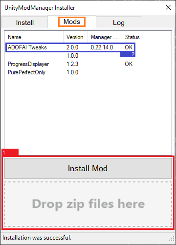
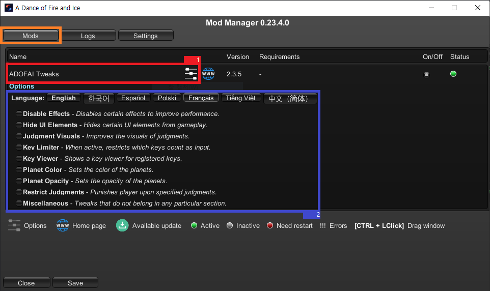
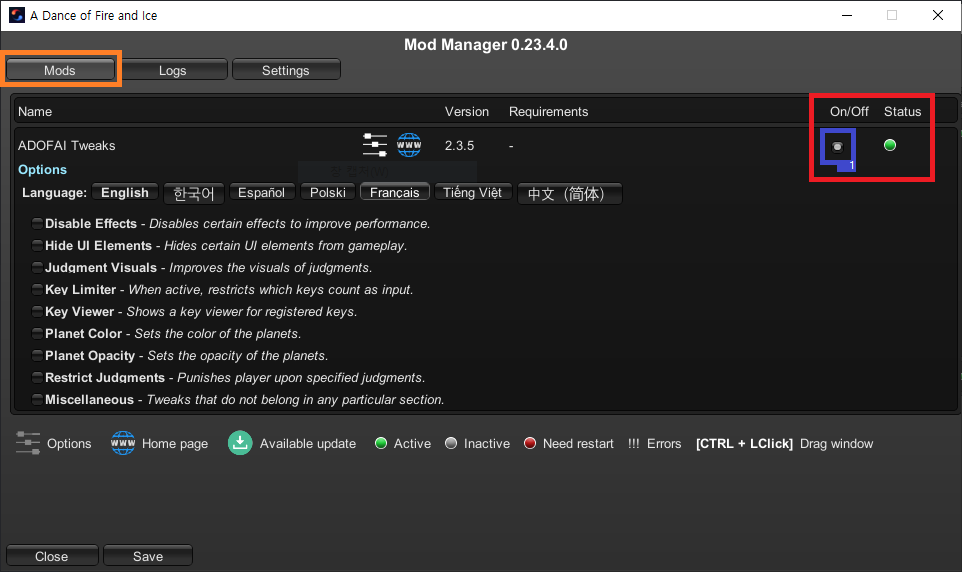

# English Modding Guide

<ins>[[< Previous Page]](./use-1.md)</ins>

## Installing ADOFAI mods and configuring them within UnityModManager

### Downloading the mod and applying it

1. Install any ADOFAI mod you'd like to. **It must be a .zip file, so do not unzip the file.**
2. Execute `UnityModManager.exe` and click the `Mods` tab.
3. Click the `Install Mod` button or drag your .zip file into the `Drop zip files here` area.
4. Check if you have the `OK` text in your mod's `Status`. If you don't have the text, then you should right click it and click `Install`.
   - If you still don't get the OK text, there's a high chance that it's a problem of the mod's file itself. Try contacting the mod developer or ask for help in the [ADOFAI.gg Community Discord](https://discord.gg/TKdpbUUfUa).
5. If there is any update for the mod, right click the mod and click `Update to vX.X.X`. If the mod's latest version cannot be checked via `UnityModManager`, you need to download the updated .zip by yourself and apply it again.

  Linux users; If ADOFAI Tweaks (or any mod) is reporting it cant read a DLL, use Proton-GE and manually re-extract the dll's it uses in
`/[where steam is installed]/Steam/steamapps/common/A Dance Of Fire And Ice/Mods/AdofaiTweaks [or another mod]`

The image below shows how UnityModManager should look like after installing a few mods.

### Configuring the mod

If the mod supports custom settings in `UnityModManager`, you can press `Ctrl + F10` (this is the default keybind, you can change this in the `Settings` tab) then click on the sliders icon to configure it. For example, the settings for `ADOFAI Tweaks` look like this:

Some mods may not have their settings in `UnityModManager`'s settings menu. You should read any instructions posted along with the mod file for how to change the settings.

### Updating the mod

If you see a download icon after the mod's name, it means there's an update available.

To update the mod, you should close the game first, open `UnityModManager.exe`, open the `Mods` tab, right-click the mod, and click `Update to vX.X.X`.

### Toggling ADOFAI mods

You can toggle some mods by clicking the checkbox in the `On/Off` column.

You can also check the status of the mod in the `Status` column.

`Status` List:

| State | Explanation                                                           |
| :---- | :-------------------------------------------------------------------- |
| !!!   | An error occurred in the mod. Check `Logs` tab to see its error logs. |
| Red   | You have to restart the game to use this mod.                         |
| Gray  | The mod is currently disabled. Toggle the mod to re-enable it.        |
| Green | The mod is currently active.                                          |
