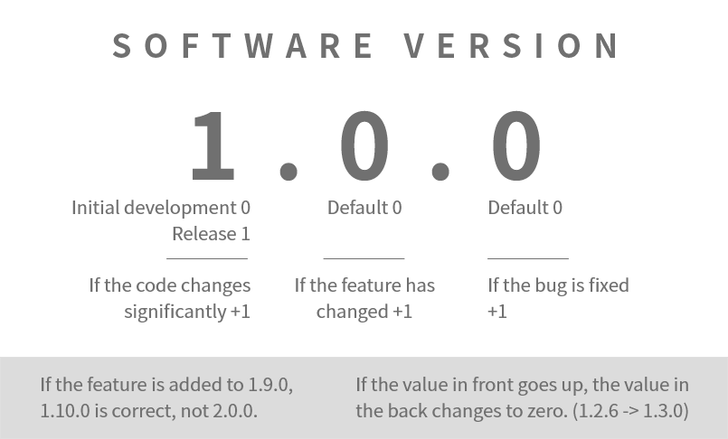

# 日本語MODガイド
<ins>[[ < 次へ ]](./dev-2.md)</ins>

MODが完成したら、人々に知らせる番です。 MODをリリースして知らせる最も効果的な方法は[ADOFAI.ggコミュニティDiscord](https://discord.gg/TKdpbUUfUa)でMODをリリースすることです。

1. コミュニティDiscordで`/createticket`を入力して`ADOFAI.gg Community`を選択してチケットを開き、Mod Developerロールの要請をしてください。
2. ロールをもらったら、`#모드-공지-mod-announcements`チャンネルに[下記のガイドライン](#)に沿ってMODをリリースできます。
3. MODをアップデートした場合、`#모드-공지-mod-announcements`チャンネルに、変更事項と共に[下記のガイドライン](#)に沿ってMODの新しいバージョンをリリースできます。

## MODリリースガイドライン

MODをリリース、アップデートする場合は下記の内容が**絶対に**含まれる必要があります。
- MODの名前
- MODのバージョン
- MODに含まれる、または追加・修正・削除された機能の説明
- MODのダウンロードリンクまたは添付されたMODファイル

下記の内容は必須ではありませんが、MODを探しやすくするため、MOD利用者の便宜のため、含まれることが勧められる内容です。
- サポートするA Dance of Fire and Iceのバージョン
- MODでサポートされる言語（UIなど）
- GitHubなど、信頼できるサイトに掲載されたMODダウンロードリンク

### MODのバージョン
MODのバージョンは[セマンティックバージョニング](https://semver.org/lang/ja/)を守って表示してください。内容が多すぎて混乱する場合は、下の画像を参考にバージョンを設定しても大丈夫です。



### MODリリース メッセージ テンプレート
この下には、上で説明した内容が全て含まれたテンプレートが記載されています。下のテンプレートの使用が強制されるわけではありませんが、下のような形式を使えば人々があなたのMODをより簡単に接近できるようになると思います。

#### 初リリース時のテンプレート
```
**YourModNameHere (1.0.0)**

**機能**
- 機能1
- 機能2

**参考事項**
（別にインストールが必要なMODライブラリ、MOD設定方法など。
無ければ削除。）

**知られている問題**
（無ければ削除。）

（ダウンロードリンク）
```

#### アップデート時のテンプレート
```
**YourModNameHere (1.1.0)**

**変更事項**
+ [追加] 機能1
- [修正] 機能2

**参考事項**
（MOD利用時に参考する内容を記入。無ければ削除。）

**知られている問題**
（なければ削除。）

（ダウンロードリンク）
```
