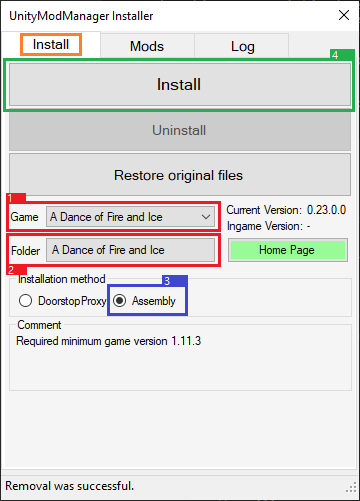
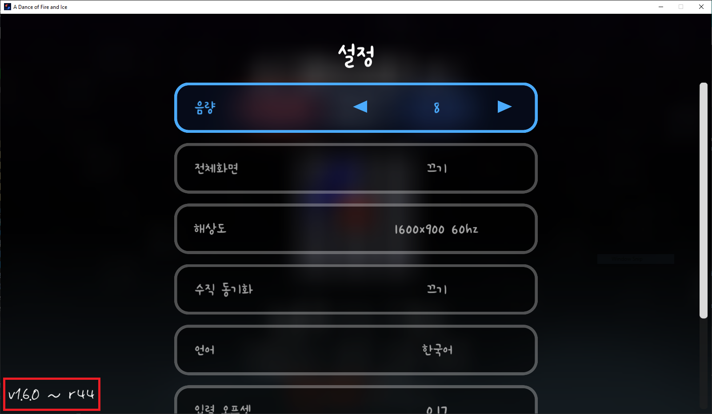
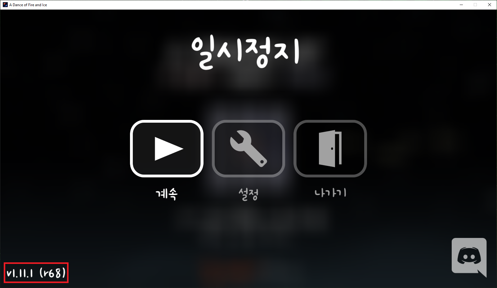

# 日本語MODガイド
<ins>[[ < 前のページへ ]](./main.md)</ins> <ins>[[ 次のページへ > ]](./use-2.md)</ins>

## UnityModManagerインストール方法

### UnityModManagerのダウンロード

1. `UnityModManager`ダウンロードリンクhttps://github.com/newman55/unity-mod-manager
    * **Dropbox**をクリックしてファイルをダウンロードできます。
2. ダウンロードした`UnityModManager.zip`ファイルを解凍してください。
    * **絶対に**ADOFAIのフォルダ内で解凍しないでください！
3. 必要な場合、[自分のゲームバージョン](#ゲームバージョンの確認)に合うように`UnityModManagerConfig.xml`ファイルを<!--[-->編集<!--]()-->し、解凍されたフォルダ内の`UnityModManager.exe`プログラムを実行してください。
4. `UnityModManager`プログラムを設定してください。
    * `Install`タブをクリックしてください。
    * `Game`の横のドロップダウンをクリックし、`A Dance of Fire and Ice`を選択してください。（もし違うゲームのMODを使う場合は、その名前を選択すればOKです。）
    * `Folder`の横のボタンをクリックし、ADOFAIがあるフォルダを選択し、OKを押してください。
    * `Installation Method`で`Assembly`を選択してください。
    * `Install` ボタンを押し、メモ帳にエラーが表示されるか確認してみてください。もしエラーが表示される場合は、設定が合っているか確認してみてください。いつでも[ADOFAI.ggコミュニティDiscord](https://discord.gg/TKdpbUUfUa)に参加してサポートを受けられます。
    * 文字で理解できなかった場合は、下の画像を御覧ください。赤→青→緑の順番で操作してください。
    

   
注意: Linux利用者は、`UnityModManager`を利用するために`mono`パッケージが必要となります。インストール後、ターミナルで
```shell
mono /path/to/UnityModManager.exe
```
を使って実行できます。

上の方法で問題が生じた場合は、sudoを一緒に使ってみてください。
```shell
sudo mono /path/to/UnityModManager.exe
```

~~ADOFAIは"Proton-GE"を使って実行してください。MODが正確にロードされます。（Steamバージョンを使わない人はWINE-GEを使えばいいと思います。）~~

現在、alphaブランチにnativeのLinux版がリリースされましたが、MODが作動するかは確認できていません。もし確認された場合はIssue/PRを開いてお知らせください！

   ---

<!-- Additonal Info -->
### 追加情報
#### ゲームバージョンの確認

古いバージョンのADOFAIの場合は、メインメニューで`Esc`キーを押し、設定ボタンを押すと左下に表示されます。


最近のバージョンのADOFAIの場合は、メインメニューで`Esc`を押すと左下に表示されます。

<!--
#### 파일 수정 (예전 버전 전용)

(2021년 2월 25일 기준) 현재 버전과 과거 버전(`1.11.1 r68 이하`)의 게임 코드가 달라서 파일을 수정해야 하는 경우가 있습니다. [여기를 누르시면 게임 내에서 버전을 보는 방법을 알려드립니다.](#게임-버전-확인)

수정해야 할 대상은 `UnityModManagerConfig.xml` 파일입니다.
```xml
<GameInfo Name="A Dance of Fire and Ice">

...

</GameInfo>
```

위 내용이 있는 라인을 찾고 안에 있는 `StartingPoint`, `UIStartingPoint`를 다음과 같이 수정해야 합니다.

게임 버전 `r68`까지는 설정을 다음과 같이 적용해야 합니다.

```xml
<StartingPoint>[Assembly-CSharp.dll]ADOBase.SetupLevelEventsInfo:Before</StartingPoint>
<UIStartingPoint>[Assembly-CSharp.dll]ADOBase.SetupLevelEventsInfo:After</UIStartingPoint>
```

버전 `r69`부터는 설정을 다음과 같이 적용해야 합니다. (<ins>이게 기본값이므로 `r69` 및 그 이후 버전을 사용하시는 분들은 설정을 바꾸지 않아도 될겁니다.</ins>)

```xml
<StartingPoint>[Assembly-CSharp.dll]ADOStartup.Startup:Before</StartingPoint>
<UIStartingPoint>[Assembly-CSharp.dll]ADOStartup.Startup:After</UIStartingPoint>
```

만약 설정이 끝났다면 이렇게 보일 것입니다. 밑의 `여러분이 설정한 내용..` 은 실질적으로 들어가는 값이 아니라 위에 보여준 두개의 설정 중 하나입니다.
```xml
<GameInfo Name="A Dance of Fire and Ice">
    <Folder>ADOFAI</Folder>
    <ModsDirectory>Mods</ModsDirectory>
    <ModInfo>Info.json</ModInfo>
    <GameExe>A Dance of Fire and Ice.exe</GameExe>
    <EntryPoint>[UnityEngine.UIModule.dll]UnityEngine.Canvas.cctor:Before</EntryPoint>
    <StartingPoint>여러분이 설정한 내용..</StartingPoint>
    <UIStartingPoint>여러분이 설정한 내용..</UIStartingPoint>
    <MinimalManagerVersion>0.22.14</MinimalManagerVersion>
    <Comment>Required minimum game version 1.11.3</Comment>
</GameInfo> 
```

[혹은 이미 여기서 수정된 파일을 다운로드할 수 있습니다.](https://drive.google.com/file/d/1BZ6XJwMnb9KsKtLcuQ5JctRs81nw_60V/view?usp=sharing)

__**또한, 파일을 교체하시거나 수정하신 이후 `UnityModManager`를 무조건 껐다 켜야 함을 숙지해 주세요.**__
-->
---

## [クリックして次のページへ進む](./use-2.md)
