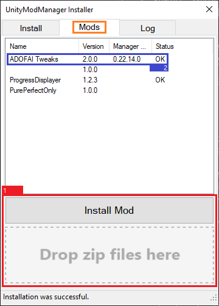

# 日本語MODガイド
<ins>[[ < 前のページへ ]](./use-1.md)</ins>

## MOD適用・使用方法

### ADOFAI MODのダウンロード及び適用

1. 任意のADOFAIのMODをダウンロードしてください。**圧縮ファイル (.zip) 以外はインストールできません！**
2. ダウンロードしたMODを解凍せず、`UnityModManager.exe`プログラムを実行して`Mods`タブをクリックしてください。
3. `Install Mod`ボタンをクリックしてファイルを選択するか、ダウンロードした圧縮ファイルを`Install Mod`の下のところにドラッグしてください。. 맨 一番右のStatusにOKが表示されたか確認し、OKが表示されてないMODは右クリックし、`Install`をクリックしでください。
   * それでもOKが表示されない場合は、MODファイルに問題がある確率が高いです。この場合はMODの開発者に問い合わせて下さい。
5. アップデートがあるMODは右クリックし、`Update to vX.X.X`をクリックしてください。もし`UnityModManager`プログラムでアップデートを確認できない場合は、直接MODのダウンロードリンクを探して、再インストールする必要があります。

理解できない場合は、下の画像を参考にしてください。

### ADOFAI MOD設定

もしMODが`UnityModManager`内でのカスタム設定をサポートする場合は、MODマネージャーを`Ctrl + F10`キーで開き（デフォルト設定、Settingsタブでいつでも変更可能）、設定があるMODをクリックしてMODの設定をできます。例えば、`ADOFAITweaks` MODの設定は次のようになります。

一部MODは`UnityModManager`だけでなく、外部設定をするよう作られる場合もあります。この場合、MODと一緒に提供された説明を読んでください。 

### MODのアップデート

もしMODの名前の横にダウンロードアイコンがある場合は、アップデートがあります。

MODをアップデートするためには、ゲームを閉じてから`UnityModManager.exe`を開いて`Mods`タブを開き、そのMODを右クリックして、`Update to vX.X.X`をクリックしてください。

### ADOFAIのMODを有効化・無効化

ADOFAIのMODは`On/Off`の下のボタンを押して有効化・無効化できます。MODがどんな状態かは、`Status`で確認できます。

`Status` 色リスト
| 状態       | 説明                                                                      |
|:-----------|:--------------------------------------------------------------------------|
| !!! | MODにエラーが発生しました。`Logs`タブを開いてエラーログを確認してみてください。 |
| 赤     | MODを使用するにはゲームの再起動が必要です。ゲームを再起動してみてください。                      |
| 灰色       | ユーザーによってMODが無効化されています。                                 |
| 緑色     | MODが正常に作動しています。                                           |