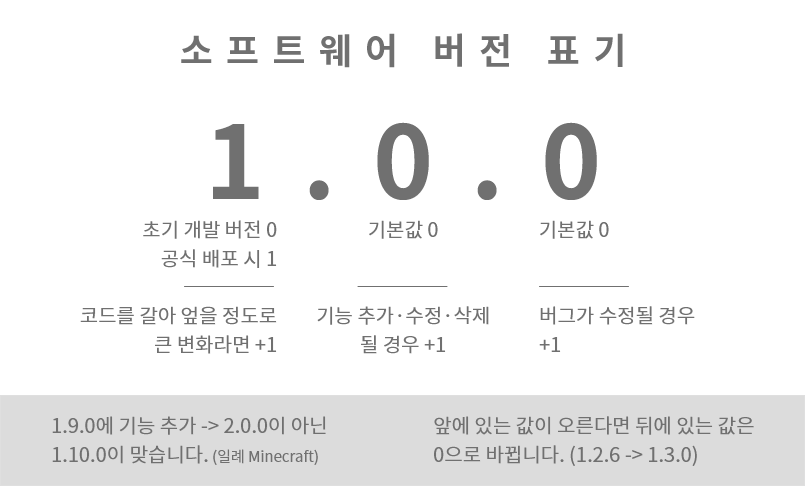

# 한국어 모딩 가이드
<ins>[[ < 이전 페이지 ]](./dev-2.md)</ins>

모드를 완성했다면 사람들에게 알릴 차례입니다. 모드를 출시해 알리는 가장 효과적인 방법은 [모딩 커뮤니티 디스코드](https://discord.gg/AGFXhCfyE5)에 모드를 출시하는 것입니다. 

1. 모딩 커뮤니티 디스코드에 있는 사람 중 SERVER OWNER 또는 ADMIN 역할이 있는 사람에게 Mod Creator 역할을 요청합니다.
2. `#모드-출시` 채널에 [아래 가이드라인](#모드-출시-가이드라인)을 따라 모드를 출시합니다.
3. 모드를 업데이트했다면, `#모드-업데이트` 채널에 변경 사항과 함께 [아래 가이드라인](#모드-출시-가이드라인)을 따라 새로운 버전의 모드를 출시합니다.

## 모드 출시 가이드라인

모드를 출시 또는 업데이트할 때에는 아래 내용이 **반드시** 들어가야 합니다.
- 모드 이름
- 모드 버전
- 모드에 포함된, 또는 추가·수정·삭제된 기능 설명
- 모드 다운로드 링크 또는 첨부된 모드 파일

아래 내용은 필수는 아니지만, 모드를 찾기 수월하게 하기 위해, 모드 이용자의 편의를 위해 포함이 권장되는 내용입니다.
- 지원되는 A Dance of Fire and Ice의 버전
- 이 모드에서 지원되는 언어 (UI 등에서)
- GitHub 등 믿을 수 있는 사이트에 게재된 모드 다운로드 링크

`#모드-출시` 채널에서 업데이트 내역을 통보하거나, 기존 메시지를 지우는 행위는 권장되지 않습니다.

### 모드의 버전
모드 버전은 [유의적 버전](https://semver.org/lang/ko/)을 지켜 표시하고, 내용이 너무 많아 헷갈린다면 아래 사진을 참고해 버전을 설정하셔도 됩니다.



### 모드 출시 메시지 템플릿
이 아래에는 위에서 설명한 내용이 전부 들어간 템플릿이 기재되어 있습니다. 아래 템플릿 사용이 강제되는 건 아닙니다.

#### 최초 공개 시 템플릿
```
**ModNameIsHere (1.0.0)**

**기능**
- 기능 1
- 기능 2

**참고 사항**
(이곳에는 따로 설치가 필요한 모드 라이브러리, 모드 설정법 등이 들어갑니다.
없으면 삭제하세요.)

**알려진 문제**
(없으면 삭제하세요.)

(다운로드 링크 또는 파일)
```

#### 업데이트 시 템플릿
```
**ModNameIsHere (1.1.0)**

**변경 사항**
- [추가] 기능 1
- [수정] 기능 2

**참고 사항**
(모드 이용 시 참고해야 하는 내용을 적고, 없으면 삭제하세요.)

**알려진 문제**
(없으면 삭제하세요.)

(다운로드 링크 또는 파일)
```
