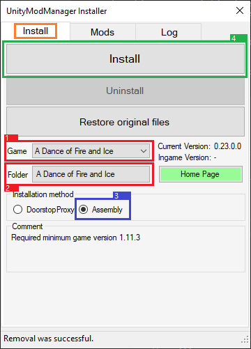
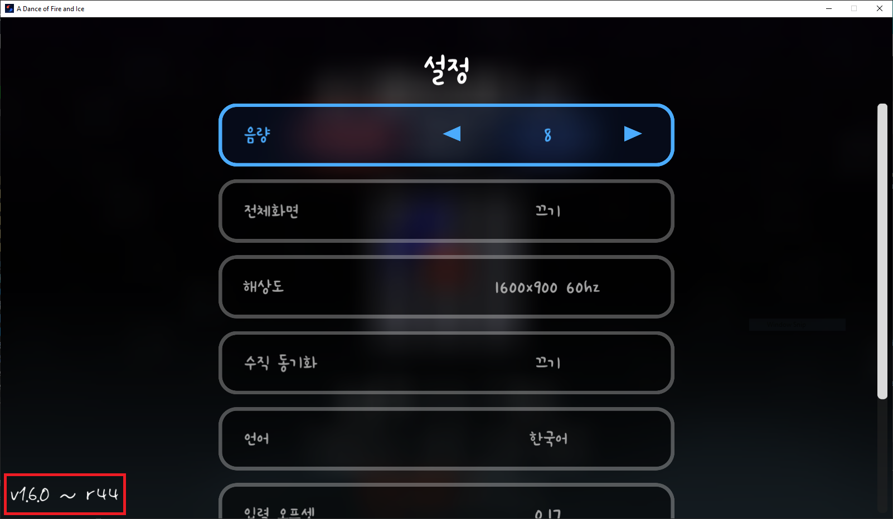

# 한국어 모딩 가이드
<ins>[[ < 이전 페이지 ]](./main.md)</ins> <ins>[[ 다음 페이지 > ]](./use-2.md)</ins>

## UnityModManager 설치 방법

### UnityModManager 다운로드하기

1. `UnityModManager` 설치 링크: https://github.com/newman55/unity-mod-manager
    * **Dropbox** 텍스트를 클릭해 파일을 다운로드 받으실 수 있습니다.
2. 다운받은 `UnityModManager.zip` 파일을 압축 해제하세요.
    * **절대로** 얼불춤 폴더 내에서 압축 해제하시면 안됩니다!
3. 필요한 경우 [자신의 게임 버전](#게임-버전-확인)에 맞게 `UnityModManagerConfig.xml` 파일을 [수정](#파일-수정)하시고, 압축 푼 폴더 안에 있는 `UnityModManager.exe` 파일을 실행하세요.
4. `UnityModManager` 프로그램을 설정해 주세요.
    * `Install` 탭을 클릭하세요.
    * `Game` 텍스트 옆에 있는 드롭다운을 클릭하시고 `A Dance of Fire and Ice`를 선택하세요. (다른 게임일 경우 다른 게임의 이름을 선택하시면 됩니다.)
    * `Folder` 텍스트 옆에 있는 버튼을 클릭하시고 얼불춤 exe 파일이 있는 폴더(되도록이면 스팀 폴더)를 선택해 주세요. 폴더를 선택하고 OK를 누르시면 됩니다.
    * `Installation Method` 그룹 이내에서 `Assembly`를 선택해주세요.
    * `Install` 버튼을 누르신 후 얼불춤을 실행하시고 메모장에 오류가 뜨는지 확인해보세요. 오류가 뜬다면 뭔가 잘못 설정한게 있는지 확인해주세요. 만약 관련해 도움이 필요하다면 언제든지 [ADOFAI.gg 커뮤니티 디스코드](https://discord.gg/TKdpbUUfUa)를 참여해 도움을 받을 수 있습니다.
    * 글로 이해가 어려우시다면 아래 사진을 참고해보세요. 빨강 → 파랑 → 초록 순입니다.
    

   
주의: Linux 사용자들은 `UnityModManager`를 사용하기 위해서는 `mono` 패키지를 다운로드해야 합니다. 그 후, 터미널에서
```shell
mono /path/to/UnityModManager.exe
```
를 사용하여 실행할 수 있습니다.

만약 위 방법으로 문제가 발생한다면, 다음과 같이 sudo와 같이 사용해 보세요.
```shell
sudo mono /path/to/UnityModManager.exe
```

~~얼불춤은 "Proton-GE"를 사용해서 실행해 주세요. GitHub에 있으며, 알맞은 모드 로딩을 합니다. (Steam 버전을 사용하지 않는 사용자들은 WINE-GE를 사용해도 될 수도 있습니다.)~~

현재 alpha 브랜치에 리눅스 대응 버전이 나왔으나, 모드가 작동할 지는 확인되지 않았습니다. 만약 확인될 시는 issue/PR를 열어서 알려 주세요!

   ---

<!-- Additonal Info -->
### 추가 정보
#### 게임 버전 확인

오래된 버전의 얼불춤은 메인 화면에서 `Esc` 키를 누른 후, 설정 버튼을 누르면 좌측 하단에 표시됩니다.


최근 버전의 얼불춤은 메인 화면에서 `Esc` 키를 누르면 좌측 하단에 표시됩니다.


#### 파일 수정 (예전 버전 전용)

(2021년 2월 25일 기준) 현재 버전과 과거 버전(`1.11.1 r68 이하`)의 게임 코드가 달라서 파일을 수정해야 하는 경우가 있습니다. [여기를 누르시면 게임 내에서 버전을 보는 방법을 알려드립니다.](#게임-버전-확인)

수정해야 할 대상은 `UnityModManagerConfig.xml` 파일입니다.
```xml
<GameInfo Name="A Dance of Fire and Ice">

...

</GameInfo>
```

위 내용이 있는 라인을 찾고 안에 있는 `StartingPoint`, `UIStartingPoint`를 다음과 같이 수정해야 합니다.

게임 버전 `r68`까지는 설정을 다음과 같이 적용해야 합니다.

```xml
<StartingPoint>[Assembly-CSharp.dll]ADOBase.SetupLevelEventsInfo:Before</StartingPoint>
<UIStartingPoint>[Assembly-CSharp.dll]ADOBase.SetupLevelEventsInfo:After</UIStartingPoint>
```

버전 `r69`부터는 설정을 다음과 같이 적용해야 합니다. (<ins>이게 기본값이므로 `r69` 및 그 이후 버전을 사용하시는 분들은 설정을 바꾸지 않아도 될겁니다.</ins>)

```xml
<StartingPoint>[Assembly-CSharp.dll]ADOStartup.Startup:Before</StartingPoint>
<UIStartingPoint>[Assembly-CSharp.dll]ADOStartup.Startup:After</UIStartingPoint>
```

만약 설정이 끝났다면 이렇게 보일 것입니다. 밑의 `여러분이 설정한 내용..` 은 실질적으로 들어가는 값이 아니라 위에 보여준 두개의 설정 중 하나입니다.
```xml
<GameInfo Name="A Dance of Fire and Ice">
    <Folder>ADOFAI</Folder>
    <ModsDirectory>Mods</ModsDirectory>
    <ModInfo>Info.json</ModInfo>
    <GameExe>A Dance of Fire and Ice.exe</GameExe>
    <EntryPoint>[UnityEngine.UIModule.dll]UnityEngine.Canvas.cctor:Before</EntryPoint>
    <StartingPoint>여러분이 설정한 내용..</StartingPoint>
    <UIStartingPoint>여러분이 설정한 내용..</UIStartingPoint>
    <MinimalManagerVersion>0.22.14</MinimalManagerVersion>
    <Comment>Required minimum game version 1.11.3</Comment>
</GameInfo> 
```

[혹은 이미 여기서 수정된 파일을 다운로드할 수 있습니다.](https://drive.google.com/file/d/1BZ6XJwMnb9KsKtLcuQ5JctRs81nw_60V/view?usp=sharing)

__**또한, 파일을 교체하시거나 수정하신 이후 `UnityModManager`를 무조건 껐다 켜야 함을 숙지해 주세요.**__

---

## [이 곳을 클릭하면 다음 페이지로 넘어갑니다.](./use-2.md)
