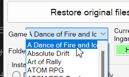
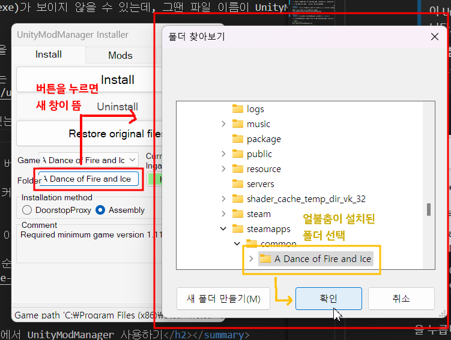
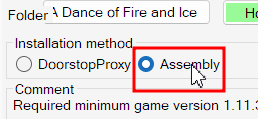
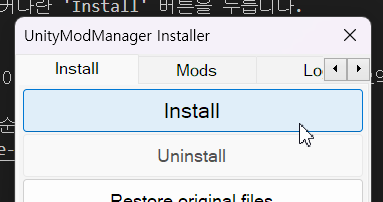
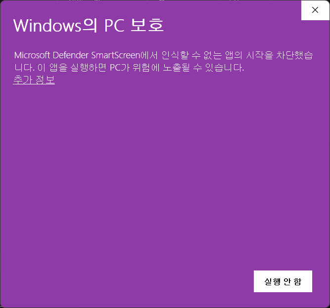
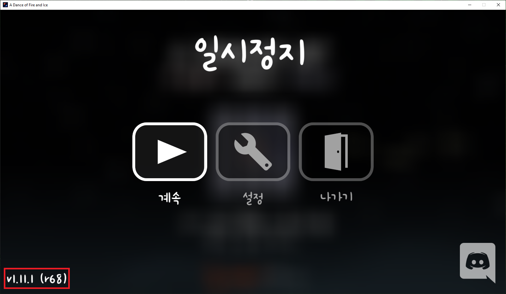

# 한국어 모딩 가이드 <!-- omit in toc -->
<ins>[[ < 이전 페이지 ]](./main.md)</ins> <ins>[[ 다음 페이지 > ]](./use-2.md)</ins>

> [!WARNING]
> 이 가이드는 오래되었습니다!
> 새로운 모드 설치 가이드는 https://adof.ai/mod 에서 확인하세요.

### 목차 <!-- omit in toc -->
- [UnityModManager에 대해](#unitymodmanager에-대해)
- [UnityModManager 설치하기](#unitymodmanager-설치하기)
- [추가 정보](#추가-정보)
  - [**[문제 해결]** UnityModManager.exe를 실행하면 윈도우가 실행을 차단함](#문제-해결-unitymodmanagerexe를-실행하면-윈도우가-실행을-차단함)
  - [얼불춤 버전 확인하기](#얼불춤-버전-확인하기)

---

## UnityModManager에 대해

얼불춤은 모드를 공식적으로 지원하고 있지 않기 때문에, 모드를 설치하기 위해서는 모드를 설치하고 관리하는 프로그램이 필요합니다.

세상에는 여러 모드 관리 프로그램이 있지만, 이 가이드에서는 가장 널리 쓰이는 UnityModManager<sub>(유니티 모드 매니저)</sub>를 설치하는 방법을 알아 보겠습니다.

## UnityModManager 설치하기

1. https://www.dropbox.com/s/wz8x8e4onjdfdbm/UnityModManager.zip?dl=0 링크로 들어가 왼쪽 위 '다운로드' 버튼을 누릅니다.

2. 다운로드받은 UnityModManager.zip의 압축을 풉니다. 앞으로 실행할 일이 꽤 있을 테니 바탕 화면처럼 눈에 띄는 곳에 푸는 걸 추천합니다.
   > ⚠️ **주의**  
   > 얼불춤 폴더에 압축을 풀면 안 됩니다.

3. 압축 푼 폴더 안에 있는 UnityModManager.exe 파일을 실행합니다.
   > ℹ️ **참고**  
   > 확장자 표시(.exe)가 보이지 않을 수 있는데, 그땐 파일 이름이 UnityModManager이면서 아이콘이 인 파일을 실행합니다.
   
   > ℹ️ **참고**  
   > 윈도우가 실행을 차단한다면 [UnityModManager.exe를 실행하면 윈도우가 실행을 차단함](#문제-해결-unitymodmanagerexe를-실행하면-윈도우가-실행을-차단함) 문단을 참고해 보세요.

4. 창 중간 쯤에 있는 'Game' 오른쪽의 드롭다운을 누르고, 'A Dance of fire and Ice'를 선택합니다. 이미 선택돼 있다면 건너 뛰어도 됩니다.  
   

6. 'Game' 아래에 있는 'Folder' 오른쪽의 버튼을 누르고, 얼불춤 게임 실행 파일이 있는 폴더를 선택하고 '확인' 버튼을 누릅니다. 이미 선택돼 있다면 건너 뛰어도 됩니다.  
   

7. 'Folder' 아래에 버튼 두 개가 있을 텐데, 'Assembly'라고 쓰여진 버튼을 누릅니다.  
   

8. 창 위 쯤에 있는 커다란 'Install' 버튼을 누릅니다.  
   

---

Linux에서 UnityModManager를 사용하고 싶다면, 아래 문단 제목을 눌러서 알아 보세요.

<details>
   <summary>
      <h2>Linux에서 UnityModManager 사용하기</h2>
   </summary>

   만약 UnityModManager를 쓰려는 운영 체제가 Windows가 아니라 Linux라면, `mono` 패키지를 다운로드하고, 터미널에서 아래 명령을 입력하면 됩니다.

   ```shell
   # 일반적인 경우
   mono /path/to/UnityModManager.exe

   # 위 명령을 썼을 때 문제가 발생했을 경우
   sudo mono /path/to/UnityModManager.exe
   ```

   현재 얼불춤이 alpha 브랜치에 리눅스 지원 버전을 배포했지만, 모드가 작동하는지는 확인되지 않았습니다. 혹시 시도해 보시면 이 리포지토리에 이슈나 풀 리퀘스트를 열어서 알려 주세요!

   ~~얼불춤은 "Proton-GE"를 사용해서 실행해 주세요. GitHub에 있으며, 알맞은 모드 로딩을 합니다. 확인된 바는 아니지만 Steam 버전을 사용하지 않는 사용자들은 WINE-GE 사용이 가능할지도 모릅니다.~~

</details>

---
<!-- Additonal Info -->

## 추가 정보
### **[문제 해결]** UnityModManager.exe를 실행하면 윈도우가 실행을 차단함



사진처럼 UnityModManager.exe를 실행하려 하면 윈도우가 실행을 차단하는 경우가 있습니다.

이때, 설명글 아래 '추가 정보'를 누르면 창 맨 아래쪽에 '실행' 버튼이 생깁니다. 그 버튼을 누르면 UnityModManager가 정상적으로 실행됩니다.


### 얼불춤 버전 확인하기

얼불춤에서 Esc 키를 누르면 나오는 일시 정지 메뉴에서 왼쪽 아래에 나오는 게 현재 컴퓨터에 깔려 있는 얼불춤의 버전입니다.

보통 v1.11.1 보다는 r68처럼 생긴 버전 형식을 보편적으로 사용합니다.



---

## [이곳을 클릭하면 다음 페이지로 넘어갑니다.](./use-2.md) <!-- omit in toc -->
