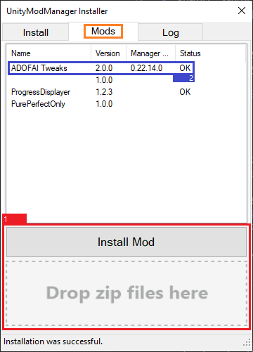
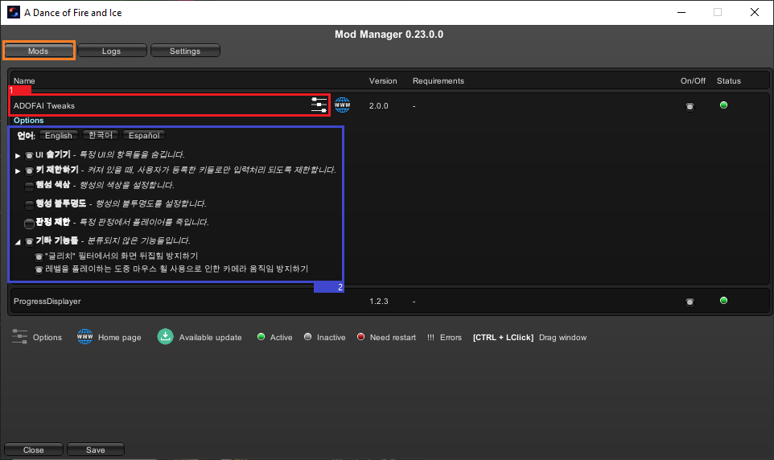
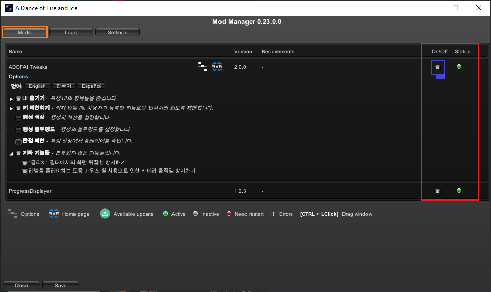

# 한국어 모딩 가이드
<ins>[[ < 이전 페이지 ]](./use-1.md)</ins>

## 모드 적용 및 사용 방법

### 얼불춤 모드 다운로드 및 적용

1. 원하는 얼불춤 모드를 설치해주세요. **압축 파일 형태 (.zip) 여야만 합니다.**
2. 설치 받은 모드를 절대 압축 해제하지 마시고, `UnityModManager.exe` 프로그램을 실행해 `Mods` 탭을 클릭해 주세요.
3. `Install Mod` 버튼을 클릭하시거나 설치받은 압축 파일을 `Install Mod` 버튼 밑 공간에 드래그하세요.
4. 맨 오른쪽 Status에 OK가 떴는지 확인하고, OK가 뜨지 않은 모드는 우클릭하고 `Install`을 눌러주세요.
    * 만약 그래도 OK가 뜨지 않는다면 모드 파일에 문제가 있을 확률이 높습니다. 이 경우, 모드의 개발자에게 문의하세요.
5. 업데이트 사항이 있는 모드는 우클릭하고 `Update to vX.X.X` 를 누르세요. 혹시 `UnityModManager` 프로그램에서 업데이트 내역을 확인할 수 없는 모드가 있다면 직접 모드의 다운로드 링크를 찾고 다시 설치하셔야 합니다.

잘 이해가 되지 않으신다면, 아래 사진을 참고해보세요.

### 얼불춤 모드 설정

만약 모드가 `UnityModManager` 안에서 사용자 지정 설정을 지원한다면, 모드 매니저를 `Ctrl + F10` 키로 열고 (기본값이며 언제든지 Settings 탭에서 여러분이 원하는 대로 키를 바꿀 수 있습니다), 설정이 있는 모드를 클릭해 모드를 설정할 수 있습니다. 예를 들어, `ADOFAI Tweaks` 모드의 내부 설정은 이렇게 보입니다:

어떤 모드는 `UnityModManager` 외부에서 설정을 수정하도록 만들어진 경우도 있습니다. 이 경우, 모드와 함께 첨부된 설명을 읽어보시길 바랍니다.

혹시 메뉴에서 설정과 웹 페이지를 여는 버튼 (설정 옆에 있는 버튼) 옆에 다운로드 아이콘이 보인다면 `UnityModManager.exe` 프로그램을 열고 위에서 설명한 대로 모드 업데이트를 하시면 됩니다.

### 얼불춤 모드 켜고 끄기

얼불춤 모드들은 `On/Off` 텍스트 밑에서 켜고 끌 수 있습니다. 모드가 어떤 상태인지는 옆 `Status`에서 확인 가능합니다.

`Status` 정리표:

| 상태       | 설명                                                                      |
|:-----------|:--------------------------------------------------------------------------|
| 느낌표 3개 | 모드에 오류가 발생한 것입니다. `Logs` 탭을 눌러 오류 로그를 확인해보세요. |
| 빨간색     | 모드가 작동하려면 게임 재시작이 필요하다는 뜻입니다.                      |
| 회색       | 사용자에 의해 모드가 꺼져있는 상태입니다.                                 |
| 초록색     | 모드가 정상적으로 작동중입니다.                                           |