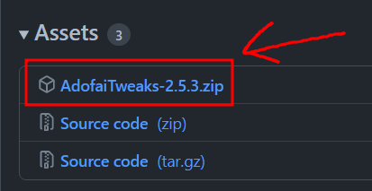
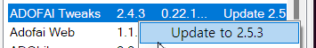

# 한국어 모딩 가이드<!-- omit in toc -->
<ins>[[ < 이전 페이지 ]](./use-1.md)</ins>

> [!WARNING]
> 이 가이드는 오래되었습니다!
> 새로운 모드 설치 가이드는 https://adof.ai/mod 에서 확인하세요.

### 목차 <!-- omit in toc -->
- [얼불춤 모드 다운로드 및 적용](#얼불춤-모드-다운로드-및-적용)
- [모드 업데이트하기](#모드-업데이트하기)
- [얼불춤 안에서 모드 설정, 관리](#얼불춤-안에서-모드-설정-관리)
  - [모드 설정하기](#모드-설정하기)
  - [모드 켜고 끄기, 상태 확인하기](#모드-켜고-끄기-상태-확인하기)
    - [Status 모양에 따른 모드 상태](#status-모양에-따른-모드-상태)
  - [모드 업데이트 확인하기](#모드-업데이트-확인하기)

## 얼불춤 모드 다운로드 및 적용

1. 설치하고자 하는 얼불춤 모드를 다운로드합니다.
    > ℹ️ **참고**  
   > 모드를 GitHub이라는 곳에서 다운로드해야 할 때가 있는데, 그땐 'Source Code'가 아니라 그 위에 있는 모드 파일을 클릭해야 합니다.
   > 

2. UnityModManager를 실행하고, Mods 탭에 들어갑니다. 이 탭에서 모드를 관리할 수 있습니다.

3. 두 가지 방법으로 모드를 적용할 수 있습니다. 원하는 방법으로 모드를 설치해 주세요.
   > ⚠️ **주의**  
   > 모드를 설치하려면 모드 파일이 zip 파일이어야 합니다. **절대로 직접 압축을 풀면 안 됩니다.**

   - **직접 선택 방법**  
    창 아래 쯤에 있는 커다란 'Install Mod' 버튼을 누르고 다운로드받은 모드 파일을 선택합니다.
    
   - **드래그 방법**  
    파일 탐색기에서 모드 파일을 마우스로 끌어서 UnityModManager의 아래 쯤 있는 'Drop zip files here'라고 쓰인 부분에 갖다 놓습니다.  
    

4. 설치한 모드가 창 중간에 있는 목록에 뜰 겁니다. 적용한 모드의 줄 맨 오른쪽 'Status' 부분에 'OK'라고 떠 있는지 확인합니다. OK가 뜨지 않는다면 두 가지 경우 중 하나입니다.
   - **UnityModManager가 옛날 버전일 경우**  
     Install 탭으로 돌아가 창 중간 쯤에 있는 초록색 `Download X.XX.X` 버튼을 눌러 줍니다. 다시 Mods 탭에 되돌아가 모드를 우클릭하고, 'Install'을 눌러 주세요.

   - **애초에 모드 파일에 문제가 있을 경우**  
     스스로 할 수 있는 방법이 딱히 없습니다. 개발자에게 문의해 주세요.

## 모드 업데이트하기

UnityModManager에서 업데이트가 필요한 모드를 우클릭하면 뜨는 `Update to vX.X.X` 버튼을 누르면 자동으로 업데이트됩니다.

위 방법이 제일 편하지만 지원하지 않는 경우가 꽤 많이 있습니다. 모드 업데이트 방법은 설치 방법이랑 똑같으니, [얼불춤 모드 다운로드 및 적용](#얼불춤-모드-다운로드-및-적용) 문단을 보며 수동으로 업데이트할 수 있습니다.

## 얼불춤 안에서 모드 설정, 관리

얼불춤에서 `Ctrl + F10` 키를 누르면 모드 매니저 창이 열릴 겁니다. 이 단축키는 기본값이니 따로 설정하지 않는 한 작동해야 합니다.

### 모드 설정하기

모드 매니저 창에서 모드를 설정할 수 있습니다. 사진에서 빨간색 부분에 있는 설정 버튼을 누르면 설정이 나타납니다.

모든 모드가 설정을 지원하는 건 아니니 설정 버튼이 없다고 해서 너무 걱정하진 않으셔도 됩니다.

### 모드 켜고 끄기, 상태 확인하기

얼불춤 모드들은 'On/Off' 부분 밑에 있는 버튼으로 켜고 끌 수 있습니다. 그 버튼 바로 오른쪽에 있는 Status 표시로 이 모드가 어떤 상태인지 확인할 수 있습니다.

#### Status 모양에 따른 모드 상태 

| 상태       | 설명                                                            |
| :--------- | :-------------------------------------------------------------- |
| 초록색     | 모드가 정상적으로 작동 중이란 뜻입니다.                         |
| 회색       | 모드가 꺼져 있다는 뜻입니다.                                    |
| 빨간색     | 모드가 정상적으로 작동하려면 게임 재시작이 필요하다는 뜻입니다. |
| 느낌표 3개 | 모드에 오류가 발생했다는 뜻입니다.                              |

### 모드 업데이트 확인하기

모드 버전 왼쪽에 다운로드 아이콘이 표시된다면, 새로운 버전이 있다는 뜻입니다.

안타깝게도 얼불춤 내에서는 모드 업데이트를 진행하지 못 합니다. [모드 업데이트하기](#모드-업데이트하기) 문단을 참고해 주세요.
